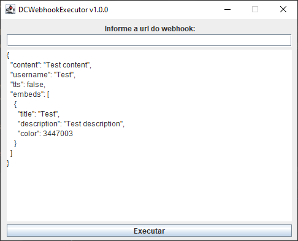

# DCWebhookExecutor
Program designed to send webhooks on discord

### Demo

> ⚠️ Not very knowledgeable about the json structure of a webhook? Take a look at this link: https://birdie0.github.io/discord-webhooks-guide/discord_webhook.html

### Output:

### Project information
|Name| DCWebhookExecutor |
|----|--|
|Version|1.0.0|
|Build|b213107|
|Developer|Kyaz0x1|
